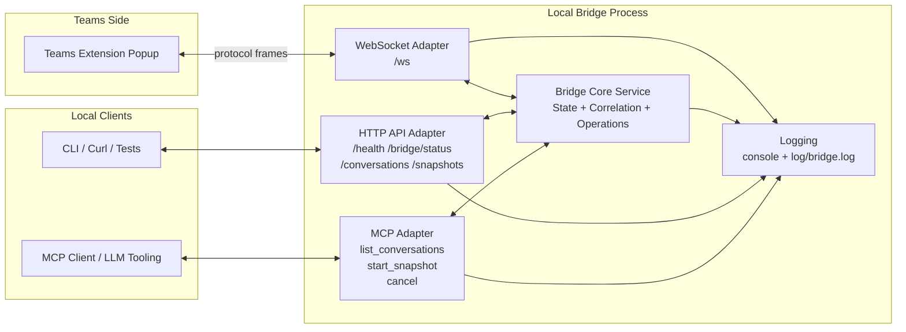

# Bridge Architecture Design

This document defines the target architecture for the Teams Chat Exporter bridge and MCP integration.

## Goals

- Keep one canonical bridge service for state and protocol logic.
- Expose that service through multiple adapters (WebSocket, HTTP API, MCP).
- Preserve v1 protocol constraints: one extension session, one active operation.

## High-Level Architecture

## Responsibilities by Layer

- WebSocket adapter (`/ws`)
  - Maintain extension socket lifecycle.
  - Parse/emit protocol frames.
  - Forward command/response handling into core service.
- Core bridge service
  - Own session state and operation state.
  - Enforce single active operation and busy rules.
  - Correlate by `requestId`.
  - Normalize error mapping (`BUSY`, `CONTEXT_LOST`, `UNSUPPORTED`).
- HTTP API adapter
  - Provide local control and observability endpoints.
  - Offer command entrypoints for non-MCP clients.
  - Provide streaming endpoint for snapshot events (SSE in Phase 3).
- MCP adapter
  - Thin wrapper over core service methods.
  - Stream chunk outputs for snapshot operations.

## Initial API Shape (Planned)

- `GET /health`
- `GET /bridge/status`
- `GET /conversations`
- `POST /snapshots`
- `POST /snapshots/{requestId}/cancel`
- `GET /snapshots/{requestId}/events` (stream)

## Design Constraints

- One extension session at a time.
- One active operation at a time (`LIST_CONVERSATIONS` or `START_SNAPSHOT`).
- `CANCEL` must be idempotent.
- `CONTEXT_LOST` is terminal until explicit reconnect.

## Near-Term Implementation Path

1. Extract core bridge service from transport logic.
2. Route post-handshake commands through core service.
3. Add `GET /health` and `GET /bridge/status`.
4. Add placeholder Phase 2 command endpoints.
5. Add MCP adapter methods that call core service directly.

## Local Validation Harness

- Consumer emulation script: `testing/emulate_consumer.py`
- Extension emulation script: `testing/emulate_extension.py`
- Runbook: `testing/README.md`
