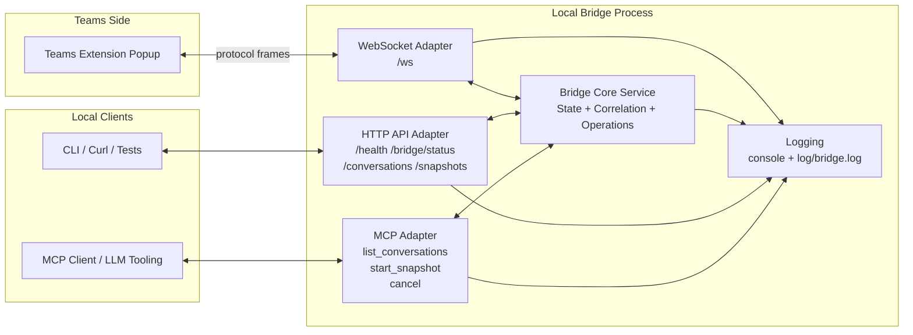

# Bridge Architecture Design

This document defines the target architecture for the Teams Chat Exporter bridge and MCP integration.

Detailed interface contracts live in:

- `SOUTHBOUND.md`
- `NORTHBOUND.md`
- `WEBSOCKET_BRIDGE_MCP_DESIGN.md`

## Goals

- Keep one canonical bridge service for state and protocol logic.
- Expose that service through multiple adapters (WebSocket, HTTP API, MCP).
- Preserve v1 protocol constraints: one extension session, one active operation.

## High-Level Architecture

## Responsibilities by Layer

- WebSocket adapter (`/ws`)
  - Maintains extension socket lifecycle and frame I/O only.
  - Is strictly southbound and extension-facing.
- Core bridge service
  - Owns session/operation state, correlation, and lifecycle semantics.
  - Is the boundary between southbound transport and northbound verbs.
- HTTP API adapter
  - Exposes northbound consumer verbs and observability endpoints.
  - Must not reuse extension websocket contracts as app-facing contracts.
- MCP adapter
  - Thin wrapper over core service methods.
  - Stream chunk outputs for snapshot operations.

## Initial API Shape (Planned)

- `GET /health`
- `GET /bridge/status`
- `GET /conversations`
- `POST /snapshots`
- `POST /snapshots/{requestId}/cancel`
- `GET /snapshots/{requestId}/events` (stream)

## Design Constraints

- One extension session at a time.
- One active operation at a time (`LIST_CONVERSATIONS` or `START_SNAPSHOT`).
- `CANCEL` must be idempotent.
- `CONTEXT_LOST` is terminal until explicit reconnect.

## Near-Term Implementation Path

1. Extract core bridge service from transport logic.
2. Keep `/ws` southbound-only (extension-facing).
3. Route app verbs through northbound endpoints into core service.
4. Replace placeholders with real extension pass-through streaming.
5. Add MCP adapter methods that call core service directly.

Current status:

- Steps 1-4 are implemented in the current codebase.
- Next major work is Step 5 (MCP adapter).

## Local Validation Harness

- Extension emulation script: `testing/emulate_extension.py`
- Consumer emulation script: `testing/emulate_consumer.py`
- Phase 3 smoke script: `testing/smoke_phase3.py`
- Backward-compatible wrapper: `testing/smoke_phase2.py`
- Runbook: `testing/README.md`
